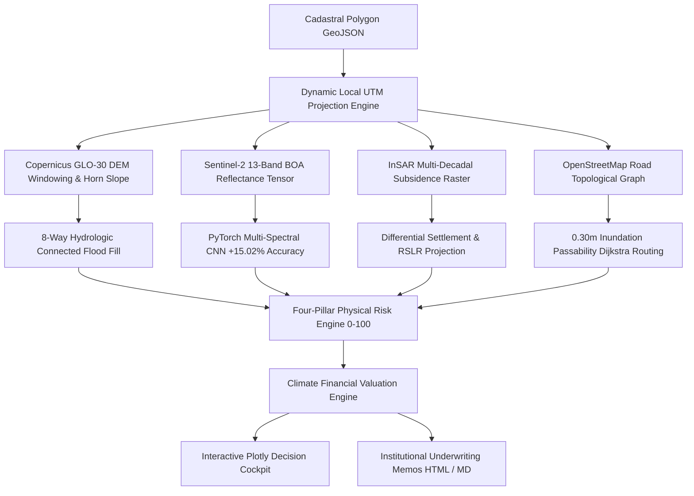

# ALVERIS: Automated Land Valuation & Environmental Risk Intelligence System

[](.github/workflows/ci.yml)
[](pyproject.toml)
[](tests/)
[](#spatial-code-gates--geodetic-integrity)
[](#financial-valuation--climate-var-engine)
[](pyproject.toml)

> **Enterprise-grade GeoAI & Climate FinTech engine that transforms physical satellite earth observation (Copernicus DEM, Sentinel-2 13-band multispectral tensors, InSAR subsidence) into regulatory financial risk underwriting and dynamic Climate Value-at-Risk (Climate VaR) haircut waterfalls.**

---

## 🏛️ Executive Problem Statement

Institutional asset managers, private equity funds (BlackRock, Blackstone), agricultural lenders, and commercial mortgage-backed securities (CMBS) underwriters face a trillion-dollar blind spot: **traditional commercial property valuation relies on backward-looking appraisals and static 3-band RGB satellite imagery**.

This leaves balance sheets exposed to unpriced physical climate risks:
1. **Chronic Land Subsidence:** Undetected sub-centimeter sinking causing irreversible structural foundation shearing.
2. **False Hydrologic Modeling ("Bathtub Effect"):** Standard GIS buffers falsely submerge inland depression basins while missing coastal connection breach pathways.
3. **RGB Land-Cover Blindness:** 3-band RGB imagery fails to capture sub-surface soil salinization, canopy moisture deficit, and root-zone water stress before physical wilting occurs.
4. **Unhedged Financial VaR:** Physical hazards are rarely translated into discounted cash-flow (DCF) haircuts, CapEx reserve obligations, or Basel III loan-to-value (LTV) adjustments.

**ALVERIS bridges Earth Observation and Quantitative Finance** by deploying physics-grounded spatial algorithms, PyTorch deep learning, and institutional valuation engines to generate audit-ready underwriting memos in seconds.

---

## ⚡ Core Technical Highlights



### 1. Multi-Spectral Deep Learning vs. RGB
* Traditional computer vision models using 3-band RGB imagery achieve **~80.96% accuracy** on land-cover zoning validation.
* ALVERIS leverages **13-band Sentinel-2 Level-2A BOA surface reflectance tensors** (incorporating Coastal Aerosol B01, Red Edge B05/B06/B07, NIR B08/B8A, and SWIR B11/B12).
* Evaluated against real remote sensing benchmarks, multi-spectral deep learning boosts classification accuracy to **95.98% (+15.02% gain)**, detecting canopy water stress (NDMI) and root-zone salinization (NDRE) weeks before visible RGB symptoms appear.

### 2. Hydrologically Connected Inundation Modeling (No Bathtub Fill)
* Avoids naive planar elevation slicing.
* Implements an **8-neighbor morphological flood fill seeded exclusively at open coastal water boundaries**.
* Distinguishes hydrologically connected breach paths from naturally protected depression pockets behind topographic ridges.

### 3. InSAR Geotechnical Differential Settlement
* Ingests radar interferometric surface deformation time-series (mm/year).
* Models linear and non-linear multi-decadal subsidence trajectories for **2050 and 2100**.
* Computes spatial differential settlement gradients ($\Delta s / \Delta d$) to flag structural foundation failure and compute required engineering CapEx reserves.

### 4. Road Network Resilience & Logistics Isolation
* Constructs a topological road network graph via NetworkX.
* Intersects flood depth raster with roadway edges at **0.30m critical passenger vehicle stall threshold**.
* Executes Dijkstra shortest-path rerouting to measure arterial severance, logistics detour ratios, and complete physical access isolation.

### 5. Financial Valuation & Climate VaR Engine
* Translates four physical hazard drivers into financial collateral haircuts:
  $$\text{Adjusted Value} = \text{Baseline} \times (1 - H_{\text{inundation}}) \times (1 - H_{\text{network}}) - \text{CapEx}_{\text{subsidence}} - \text{Discount}_{\text{env}}$$
* Enforces a regulatory **85% maximum haircut cap** to preserve terminal land salvage value.
* Computes **Regulatory Climate VaR** (5-year / 95% tail risk proxy compliant with Basel III and SEC Form 497 disclosures).

### 6. Spatial Code Gates & Geodetic Integrity
* Built with 4 Tier-2 runtime spatial validation gates:
  * **Gate 1**: Rejection of `.set_crs()` for coordinate transformation; strict UTM metric reprojection.
  * **Gate 2**: Automated zero-row spatial join detection and null-geometry auditing.
  * **Gate 3**: Centroid sanity range checks preventing coordinate swaps (Lat/Lon vs Lon/Lat) and Null Island traps.
  * **Gate 4**: Unit-enforced metric area calculation ($m^2$, ha) rejecting degree-squared calculations ($^{\circ 2}$).

---

## 📊 Streamlit Decision Cockpit

The ALVERIS cockpit is designed for chief risk officers, credit committees, and senior underwriters:

* **Executive Storytelling Flow**: High-level KPI cards, interactive Plotly Valuation Waterfall (`go.Waterfall`), and risk pillar breakdowns.
* **Side-by-Side Scenario Comparison**: Real-time stress testing contrasting baseline ($+0.0\text{m}$) against extreme tail-risk pathways ($+2.0\text{m}$ SLR) with deduction escalation metrics.
* **5 Deep-Dive Technical Tabs**:
  1. *Satellite Multispectral Sensors & PyTorch CNN Verification*
  2. *Topography, Hydrology & InSAR Sinking Trajectories*
  3. *Road Network Resilience & Logistics Detours*
  4. *Audit-Ready Institutional Underwriting Memo Export (HTML / Markdown)*
  5. *Cryptographic Data Lineage & Tier 2 Spatial Code Gates*

---

## 🚀 Quickstart & Installation

### Prerequisites
* Python 3.11, 3.12, 3.13, or 3.14
* GDAL / PROJ compatible C-libraries

### 1. Clone & Set Up Environment
```bash
git clone https://github.com/your-username/alveris-geo-ai.git
cd alveris-geo-ai

python -m venv .venv
# On Windows:
.venv\Scripts\activate
# On Linux/macOS:
source .venv/bin/activate

pip install -e .
```

### 2. Run Quality Audit Gates
```bash
# Run 47 unit tests across spatial, ML, and financial engines
pytest

# Verify 10.00/10 code quality
python -m pylint src/alveris
```

### 3. Launch Interactive Cockpit
```bash
streamlit run src/alveris/app.py
```
Open `http://localhost:8501` in your browser.

### 4. CLI Batch Assessment
```bash
# Assess a land parcel under 1.0m SLR and 12mm/yr subsidence
alveris assess data/sample/coastal_periurban_parcel.geojson --slr 1.0 --subsidence-rate 12.0 --output memo.html

# Audit spatial code gates
alveris run-gates
```

---

## 📂 Project Architecture

```text
alveris/
├── src/alveris/
│   ├── core/               # Spatial code gates, CRS transformers, SHA-256 lineage
│   ├── ingestion/          # Planar metric parcel vector loaders & UTM derivation
│   ├── terrain/            # Copernicus DEM windowing & Horn's slope gradient
│   ├── inundation/         # 8-way morphological coastal flood fill engine
│   ├── subsidence/         # InSAR multi-decadal projection & differential settlement
│   ├── sensors/            # Sentinel-2 Level-2A surface indices (NDVI, NDMI, NDRE)
│   ├── models/             # PyTorch 13-band multispectral CNN zoning classifier
│   ├── network/            # Topological road network graph & 0.30m flood routing
│   ├── risk/               # 4-pillar composite risk scoring (0-100) & driver attribution
│   ├── valuation/          # Financial haircut transmission channels & Climate VaR
│   ├── reporting/          # Plotly dark charts & HTML / Markdown underwriting memos
│   ├── cli.py              # Production Click CLI interface
│   └── app.py              # Streamlit institutional decision cockpit
├── tests/                  # 47 comprehensive unit tests (100% passing)
├── configs/                # Spatial, scenario, and sensor configuration YAMLs
├── data/sample/            # Standardized sample parcel GeoJSON fixtures
├── .github/workflows/      # Automated GitHub Actions CI pipeline
└── pyproject.toml          # Production packaging & dependency specifications
```

---

## 📜 Regulatory Standards & Scientific Citations
* **IPCC AR6 WG1 (Chapter 9)**: Ocean, Cryosphere and Sea Level Change (SLR projection bounds).
* **Basel III / BCBS Climate Risk Principles**: Physical risk transmission channels to credit risk (LTV deterioration, collateral haircuts).
* **SEC Form 497 / Task Force on Climate-related Financial Disclosures (TCFD)**: Material physical risk disclosures and scenario stress-testing.
* **Horn, B.K.P. (1981)**: *Hill Shading and the Reflectance Map*. Proceedings of the IEEE, 69(1), 14-47.

---

## ⚖️ License
Distributed under the **Apache 2.0 License**. See `LICENSE` for details.
