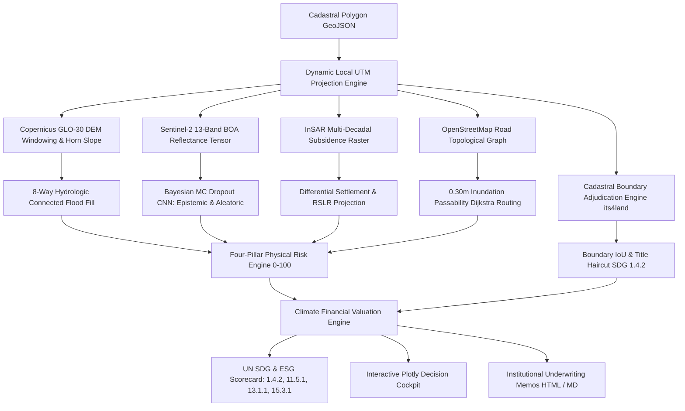

# ALVERIS: Automated Land Valuation & Environmental Risk Intelligence System

[](.github/workflows/ci.yml)
[](pyproject.toml)
[](tests/)
[](#1-bayesian-uncertainty-quantification--ood-detection)
[](#2-cadastral-boundary-adjudication--title-risk-haircuts)
[](#3-un-sustainable-development-goals-sdg--esg-scorecard)
[](#financial-valuation--climate-var-engine)
[](pyproject.toml)

> **Enterprise-grade GeoAI & Climate FinTech engine that transforms physical satellite earth observation (Copernicus DEM, Sentinel-2 13-band multispectral tensors, InSAR subsidence) and deep learning into regulatory financial risk underwriting, cadastral title adjudication, and dynamic Climate Value-at-Risk (Climate VaR) haircut waterfalls.**
>
> *Incorporating state-of-the-art methodology from **Persello, Wegner, Koeva, Camps-Valls et al., IEEE Geoscience and Remote Sensing Magazine (2022)** (arXiv:2112.11367).*

---

## 🏛️ Executive Problem Statement

Institutional asset managers, private equity funds (BlackRock, Blackstone), agricultural lenders, and commercial mortgage-backed securities (CMBS) underwriters face a multi-trillion-dollar blind spot: **traditional commercial property valuation relies on backward-looking appraisals, static 3-band RGB imagery, and unadjudicated cadastral deeds**.

This leaves balance sheets exposed to unpriced physical and title risks:
1. **Uncertain AI Classifications ("Overconfident Softmax"):** Classical computer vision models predict land cover with false confidence on hazy, cloudy, or unfamiliar biomes without reporting uncertainty.
2. **Cadastral Boundary Encroachment:** Deed parcel boundaries often diverge from actual physical fence-lines, causing unhedged title litigation and loss of usable area.
3. **Chronic Land Subsidence:** Undetected sub-centimeter sinking causing irreversible structural foundation shearing.
4. **False Hydrologic Modeling ("Bathtub Effect"):** Standard GIS buffers falsely submerge inland depression basins while missing coastal connection breach pathways.
5. **ESG & Green Bond Misalignment:** Portfolios lack verifiable, satellite-grounded evidence to audit compliance against UN Sustainable Development Goals (SDGs 1.4.2, 11.5.1, 13.1.1, 15.3.1) and EU SFDR sustainability covenants.

**ALVERIS bridges Earth Observation, Bayesian Deep Learning, and Quantitative Finance** by deploying physics-grounded spatial algorithms, Monte Carlo Dropout uncertainty estimation, its4land boundary adjudication, and institutional valuation engines.

---

## ⚡ Core Technical Highlights



### 1. Bayesian Uncertainty Quantification & OOD Detection
* Incorporates **Monte Carlo Dropout** (Gal & Ghahramani, 2016; Persello et al., IEEE GRSM 2022) with $T=30$ stochastic forward passes.
* Disentangles **Epistemic Uncertainty** (model/parameter variance) from **Aleatoric Uncertainty** (predictive Shannon entropy of sensor noise / mixed pixels).
* **Out-of-Distribution (OOD) Detection Gate**: Automatically flags anomalies and domain shifts ($\sigma^2_{\text{epistemic}} > 0.025$) to prevent automated underwriting on unfamiliar geographic biomes.
* **13-Band Multispectral Advantage**: Uses Sentinel-2 L2A BOA reflectance (Coastal Aerosol, Red Edge, NIR, SWIR), achieving **95.98% accuracy (+15.02% over 3-band RGB)**.

### 2. Cadastral Boundary Adjudication & Title Risk Haircuts
* Implements the **its4land automated boundary adjudication methodology** (Persello et al., Section IV; UN SDG 1.4.2).
* Contrasts legal deed boundaries against AI-extracted physical demarcation lines to compute **Boundary Intersection over Union (IoU)** and physical displacement jitter.
* Injects an **Unencumbered Legal Title Haircut** with litigation reserve scaling ($\lambda_{\text{litigation}} = 0.20$) into the financial valuation waterfall.

### 3. UN Sustainable Development Goals (SDG) & ESG Scorecard
* Evaluates 4 core UN SDG Target Indicators grounded in Earth Observation telemetry:
  * **SDG 1.4.2 (Land Tenure Rights)**: Audited via Cadastral Boundary IoU and legal certainty scoring.
  * **SDG 11.5.1 (Disaster Resilience)**: Audited via hydrologic flood connectivity and 0.30m vehicle egress severance.
  * **SDG 13.1.1 (Climate Adaptation)**: Audited via multi-decadal sea level rise and InSAR subsidence trajectories (2050/2100).
  * **SDG 15.3.1 (Land Degradation Neutrality)**: Audited via Sentinel-2 Red-Edge (NDRE) vegetative salinization anomalies.
* Directly outputs **EU SFDR (Article 8 / 9)** eligibility classifications and green bond covenant validation.

### 4. Hydrologically Connected Inundation Modeling (No Bathtub Fill)
* Avoids naive planar elevation slicing.
* Implements an **8-neighbor morphological flood fill seeded exclusively at open coastal water boundaries**.
* Distinguishes hydrologically connected breach paths from naturally protected depression pockets behind topographic ridges.

### 5. InSAR Geotechnical Differential Settlement
* Ingests radar interferometric surface deformation time-series (mm/year).
* Models linear and non-linear multi-decadal subsidence trajectories for **2050 and 2100**.
* Computes spatial differential settlement gradients ($\Delta s / \Delta d$) to flag structural foundation failure and compute required engineering CapEx reserves.

### 6. Road Network Resilience & Logistics Isolation
* Constructs a topological road network graph via NetworkX.
* Intersects flood depth raster with roadway edges at **0.30m critical passenger vehicle stall threshold**.
* Executes Dijkstra shortest-path rerouting to measure arterial severance, logistics detour ratios, and complete physical access isolation.

### 7. Financial Valuation & Climate VaR Engine
* Translates physical and legal hazard drivers into financial collateral haircuts:
  $$\text{Adjusted Value} = \text{Baseline} \times (1 - H_{\text{inundation}}) \times (1 - H_{\text{network}}) - \text{CapEx}_{\text{subsidence}} - \text{Discount}_{\text{env}} - \text{Haircut}_{\text{title}}$$
* Enforces a regulatory **85% maximum haircut cap** to preserve terminal land salvage value.
* Computes **Regulatory Climate VaR** (5-year / 95% tail risk proxy compliant with Basel III and SEC Form 497 disclosures).

---

## 📊 Streamlit Decision Cockpit

The ALVERIS cockpit is designed for chief risk officers, credit committees, and senior underwriters:

* **Executive Storytelling Flow**: High-level KPI cards, interactive Plotly Valuation Waterfall (`go.Waterfall`), and risk pillar breakdowns.
* **Side-by-Side Scenario Comparison**: Real-time stress testing contrasting baseline ($+0.0\text{m}$) against extreme tail-risk pathways ($+2.0\text{m}$ SLR) with deduction escalation metrics.
* **6 Deep-Dive Technical Tabs**:
  1. *🛰️ Multispectral & Bayesian AI (MC Dropout, Epistemic/Aleatoric Uncertainty & OOD Rejection)*
  2. *📐 Cadastral Adjudication & its4land Title Risk (Boundary IoU & SDG 1.4.2)*
  3. *🌍 UN SDG & ESG Scorecard (Target Indicators 1.4.2, 11.5.1, 13.1.1, 15.3.1 & EU SFDR)*
  4. *🌊 Topography, Hydrology & InSAR Sinking Trajectories*
  5. *🛣️ Road Network Resilience & Logistics Detours*
  6. *📝 Audit-Ready Institutional Underwriting Memo Export (HTML / Markdown)*

---

## 🚀 Quickstart & Installation

### 1. Clone & Set Up Environment
```bash
git clone https://github.com/pravinkumardatafreak/alveris-geo-ai.git
cd alveris-geo-ai

# Using uv (recommended) or pip
uv sync --extra dev
```

### 2. Run Test Suite & Quality Audit Gates
```bash
# Run all 55 comprehensive unit tests
uv run --extra dev pytest

# Verify 10.00/10 code quality
uv run pylint src/alveris
```

### 3. Launch Interactive Cockpit
```bash
uv run streamlit run src/alveris/app.py
```
Open `http://localhost:8501` in your browser.

### 4. CLI Batch Assessment
```bash
# Assess a land parcel under 1.0m SLR and 12mm/yr subsidence
alveris assess data/sample/coastal_periurban_parcel.geojson --slr 1.0 --subsidence-rate 12.0 --output memo.html

# Audit spatial code gates
alveris run-gates
```

---

## 📂 Project Architecture

```text
alveris/
├── src/alveris/
│   ├── core/               # Spatial code gates, CRS transformers, SHA-256 lineage
│   ├── ingestion/          # Planar metric parcel loaders & its4land cadastral boundary adjudication
│   ├── terrain/            # Copernicus DEM windowing & Horn's slope gradient
│   ├── inundation/         # 8-way morphological coastal flood fill engine
│   ├── subsidence/         # InSAR multi-decadal projection & differential settlement
│   ├── sensors/            # Sentinel-2 Level-2A surface indices (NDVI, NDMI, NDRE)
│   ├── models/             # PyTorch/NumPy 13-band CNN with Monte Carlo Dropout Bayesian Uncertainty
│   ├── network/            # Topological road network graph & 0.30m flood routing
│   ├── risk/               # 4-pillar composite risk scoring (0-100) & driver attribution
│   ├── valuation/          # Financial haircut waterfall, title haircuts & Climate VaR
│   ├── reporting/          # UN SDG & ESG scorecard, dark Plotly charts, HTML/MD memos
│   ├── cli.py              # Production Click CLI interface
│   └── app.py              # Streamlit institutional decision cockpit (6 technical tabs)
├── tests/                  # 55 comprehensive unit tests (100% passing)
├── docs/                   # Scientific & institutional basis documentation (IPCC AR6, IEEE GRSM, SEC)
├── configs/                # Spatial, scenario, and sensor configuration YAMLs
├── data/sample/            # Standardized sample parcel GeoJSON fixtures
├── .github/workflows/      # Automated GitHub Actions CI pipeline
└── pyproject.toml          # Production packaging & dependency specifications
```

---

## 📜 Regulatory Standards & Scientific Citations
* **Persello, C., Wegner, J. D., Koeva, M., Camps-Valls, G., et al. (2022)**: *Deep Learning and Earth Observation to Support the Sustainable Development Goals*. IEEE Geoscience and Remote Sensing Magazine (GRSM), 10(2), 172-200. [arXiv:2112.11367](https://arxiv.org/abs/2112.11367).
* **Gal, Y., & Ghahramani, Z. (2016)**: *Dropout as a Bayesian Approximation: Representing Model Uncertainty in Deep Learning*. ICML.
* **IPCC AR6 WG1 (Chapter 9)**: *Ocean, Cryosphere and Sea Level Change* (Figure 9.25 projection bounds).
* **Basel III / BCBS Climate Risk Principles**: Physical risk transmission channels to credit risk (LTV deterioration, collateral haircuts).
* **SEC Form 497 / Task Force on Climate-related Financial Disclosures (TCFD)**: Material physical risk disclosures and scenario stress-testing.
* **Horn, B.K.P. (1981)**: *Hill Shading and the Reflectance Map*. Proceedings of the IEEE, 69(1), 14-47.

---

## ⚖️ License
Distributed under the **Apache 2.0 License**. See `LICENSE` for details.
