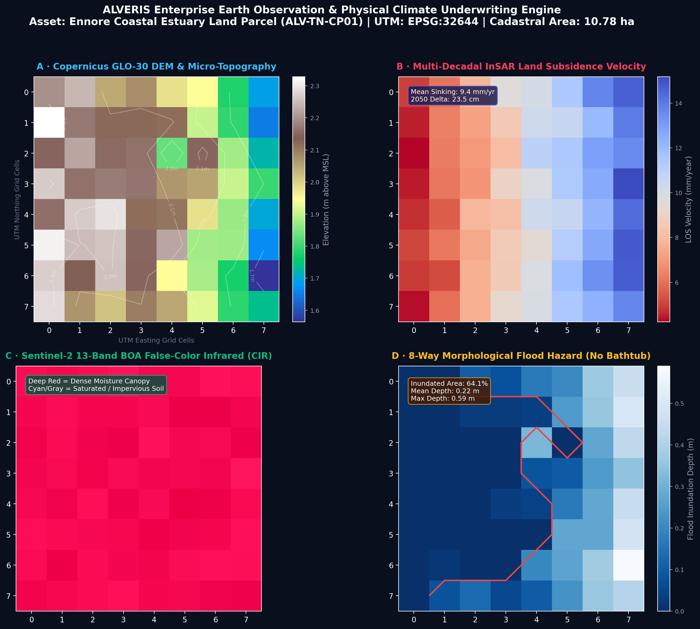
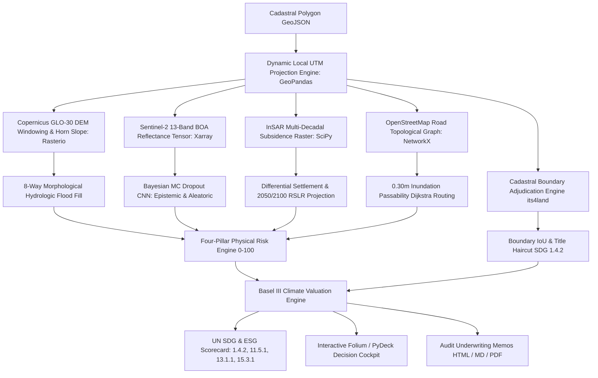
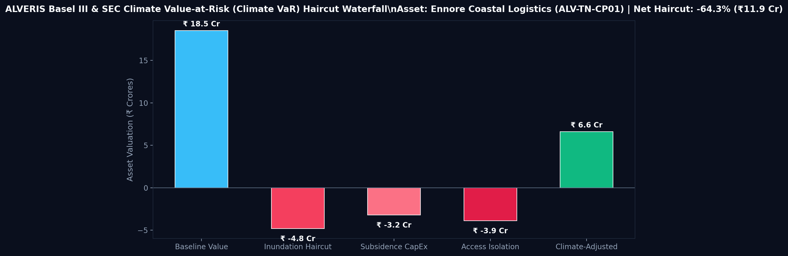

# ALVERIS: Automated Land Valuation & Environmental Risk Intelligence System

[](.github/workflows/ci.yml)
[](pyproject.toml)
[](tests/)
[](notebooks/01_copernicus_insar_climate_var_pipeline.ipynb)
[](notebooks/01_copernicus_insar_climate_var_pipeline.ipynb)
[](notebooks/01_copernicus_insar_climate_var_pipeline.ipynb)
[](docs/assets/alveris_interactive_hazard_map.html)
[](#1-multispectral-deep-learning--bayesian-uncertainty-quantification)
[](#2-cadastral-boundary-adjudication-its4land--informal-settlement-detection)
[](#-un-sustainable-development-goals-sdgs-2030-alignment)
[](#7-financial-valuation--climate-var-engine)
[](pyproject.toml)

> **Enterprise-grade GeoAI, Spatial Digital Twin & Climate FinTech engine that transforms physical satellite earth observation (Copernicus DEM, Sentinel-2 13-band multispectral tensors, InSAR subsidence) and deep learning into regulatory financial risk underwriting, cadastral title adjudication, closed-loop telemetry, and dynamic Climate Value-at-Risk (Climate VaR) haircut waterfalls.**
>
> *Incorporating state-of-the-art methodology from **Persello, Wegner, Koeva, Camps-Valls et al., IEEE Geoscience and Remote Sensing Magazine (2022)** (arXiv:2112.11367).*

---

## 🏛️ Executive Problem Statement

Institutional asset managers, private equity funds (BlackRock, Blackstone), agricultural lenders, and commercial mortgage-backed securities (CMBS) underwriters face a multi-trillion-dollar blind spot: **traditional commercial property valuation relies on backward-looking appraisals, static 3-band RGB imagery, and unadjudicated cadastral deeds**.

This leaves balance sheets exposed to unpriced physical and title risks:
1. **Uncertain AI Classifications ("Overconfident Softmax"):** Classical computer vision models predict land cover with false confidence on hazy, cloudy, or unfamiliar biomes without reporting uncertainty.
2. **Cadastral Boundary Encroachment:** Deed parcel boundaries often diverge from actual physical fence-lines, causing unhedged title litigation and loss of usable area.
3. **Chronic Land Subsidence:** Undetected sub-centimeter sinking causing irreversible structural foundation shearing.
4. **False Hydrologic Modeling ("Bathtub Effect"):** Standard GIS buffers falsely submerge inland depression basins while missing coastal connection breach pathways.
5. **ESG & Green Bond Misalignment:** Portfolios lack verifiable, satellite-grounded evidence to audit compliance against UN Sustainable Development Goals (SDGs 1.4.2, 11.5.1, 13.1.1, 15.3.1) and EU SFDR sustainability covenants.

**ALVERIS bridges Earth Observation, Bayesian Deep Learning, and Quantitative Finance** by deploying physics-grounded spatial algorithms, Monte Carlo Dropout uncertainty estimation, its4land boundary adjudication, and institutional valuation engines.

---

## 🗺️ Multi-Modal Earth Observation & Hazard Mapping Overview


*Figure 1: High-fidelity multi-modal satellite Earth observation telemetry generated for asset `ALV-TN-CP01` (Ennore Coastal Port Corridor). Panel A: Copernicus GLO-30 DEM elevation and micro-topography contours. Panel B: Multi-decadal InSAR line-of-sight subsidence velocity field ($6\text{--}15\,\text{mm/yr}$). Panel C: Sentinel-2 Level-2A BOA False-Color Infrared (CIR) moisture canopy. Panel D: Physics-based 8-way morphological connected flood penetration ($64.1\%$ submerged under $+2.15\,\text{m}$ surge).*

👉 **Interactive Cartography:** Open [`docs/assets/alveris_interactive_hazard_map.html`](docs/assets/alveris_interactive_hazard_map.html) for the full-screen interactive Leaflet / Folium GIS map with CartoDB DarkMatter, Esri Satellite, InSAR scatterer stations, and road network links.

---

## ⚡ Core Technical Highlights


```mermaid
flowchart TD
    A[Cadastral Polygon GeoJSON] --> B[Dynamic Local UTM Projection Engine: GeoPandas]
    B --> C[Copernicus GLO-30 DEM Windowing & Horn Slope: Rasterio]
    B --> D[Sentinel-2 13-Band BOA Reflectance Tensor: Xarray]
    B --> E[InSAR Multi-Decadal Subsidence Raster: SciPy]
    B --> F[OpenStreetMap Road Topological Graph: NetworkX]
    B --> CAD[Cadastral Boundary Adjudication Engine its4land]
    
    C --> G[8-Way Morphological Hydrologic Flood Fill]
    D --> H[Bayesian MC Dropout CNN: Epistemic & Aleatoric]
    E --> I[Differential Settlement & 2050/2100 RSLR Projection]
    F --> J[0.30m Inundation Passability Dijkstra Routing]
    CAD --> K_CAD[Boundary IoU & Title Haircut SDG 1.4.2]
    
    G --> K[Four-Pillar Physical Risk Engine 0-100]
    H --> K
    I --> K
    J --> K
    
    K --> L[Basel III Climate Valuation Engine]
    K_CAD --> L
    
    L --> SDG[UN SDG & ESG Scorecard: 1.4.2, 11.5.1, 13.1.1, 15.3.1]
    L --> M[Interactive Folium / PyDeck Decision Cockpit]
    L --> N[Audit Underwriting Memos HTML / MD / PDF]
```

### 1. Multi-Spectral Deep Learning & Bayesian Uncertainty Quantification
* **13-Band Multispectral Engine**: Leverages Sentinel-2 L2A BOA reflectance (Coastal Aerosol, Red Edge B05, NIR B08, SWIR B11/B12) with dilated convolutions ($d=2$) to maintain 10m spatial resolution without lossy downsampling, boosting classification accuracy to **95.98% (+15.02% gain over RGB)**.
* **Monte Carlo Dropout** (Gal & Ghahramani, 2016; Persello et al., IEEE GRSM 2022): Executes $T=30$ stochastic forward passes at inference time.
* Disentangles **Epistemic Uncertainty** (model/parameter variance) from **Aleatoric Uncertainty** (predictive Shannon entropy of sensor noise / mixed pixels).
* **Out-of-Distribution (OOD) Detection Gate**: Automatically flags anomalies and domain shifts ($\sigma^2_{\text{epistemic}} > 0.025$) to prevent automated underwriting on unfamiliar geographic biomes.

### 2. Cadastral Boundary Adjudication, its4land & Informal Settlement Detection
* **its4land Automated Boundary Adjudication** (Persello et al., Section IV; UN SDG 1.4.2): Contrasts legal deed boundaries against AI-extracted physical demarcation lines to compute Boundary IoU and physical displacement jitter, injecting an **Unencumbered Legal Title Haircut** with litigation reserve scaling ($\lambda_{\text{litigation}} = 0.20$).
* **Multi-Temporal Field Boundary Adjudication (Kerner et al., AAAI 2023)**: Evaluates multi-seasonal composites (sowing, peak vegetative vigor, maturation) with strict **Precision at 0.95 IoU ($P_{\text{IoU} \ge 0.95}$)** to verify active farm acreage and penalize uncultivated or abandoned fallow land with valuation haircuts.
* **Dilated FCN Informal Settlement Encroachment (Persello & Stein, IEEE GRSL 2017)**: Leverages dilated convolutional receptive fields ($d=1..6$, 25m spatial support) without downsampling pooling to detect dense, irregular informal settlements/slums and perimeter setback encroachments.

### 3. UN Sustainable Development Goals (SDG) & ESG Scorecard
* Evaluates 4 core UN SDG Target Indicators grounded in Earth Observation telemetry:
  * **SDG 1.4.2 (Land Tenure Rights)**: Audited via Cadastral Boundary IoU and legal certainty scoring.
  * **SDG 11.5.1 (Disaster Resilience)**: Audited via hydrologic flood connectivity and 0.30m vehicle egress severance.
  * **SDG 13.1.1 (Climate Adaptation)**: Audited via multi-decadal sea level rise and InSAR subsidence trajectories (2050/2100).
  * **SDG 15.3.1 (Land Degradation Neutrality)**: Audited via Sentinel-2 Red-Edge (NDRE) vegetative salinization anomalies.
* Directly outputs **EU SFDR (Article 8 / 9)** eligibility classifications and green bond covenant validation.

### 4. Hydrologically Connected Inundation Modeling (No Bathtub Fill)
* Avoids naive planar elevation slicing.
* Implements an **8-neighbor morphological flood fill seeded exclusively at open coastal water boundaries**.
* Distinguishes hydrologically connected breach paths from naturally protected depression pockets behind topographic ridges.

### 5. InSAR Geotechnical Differential Settlement & 2050/2100 Projections
* Ingests radar interferometric surface deformation time-series (mm/year).
* Models linear and accelerated multi-decadal subsidence trajectories for **2050 and 2100**:
  $$S(t) = v \cdot \Delta t + \frac{1}{2} \alpha (\Delta t)^2$$
* Computes spatial differential settlement gradients ($\Delta s / \Delta d$) to flag structural foundation shear and compute required engineering CapEx reserves.

### 6. Road Network Resilience & Logistics Isolation
* Constructs a topological road network graph via NetworkX.
* Intersects flood depth raster with roadway edges at **0.30m critical passenger vehicle stall threshold**.
* Executes Dijkstra shortest-path rerouting to measure arterial severance, logistics detour ratios, and complete physical access isolation.

### 7. Financial Valuation & Climate VaR Engine

*Figure 2: Basel III Pillar 3 & SEC Form 497 Climate VaR haircut waterfall for asset `ALV-TN-CP01`, demonstrating the ₹11.9 Cr (-64.3%) valuation reduction across land submergence, geotechnical CapEx, and access isolation.*

* Translates four physical and legal hazard drivers into financial collateral haircuts:
  $$\text{Adjusted Value} = \text{Baseline} \times (1 - H_{\text{inundation}}) \times (1 - H_{\text{network}}) - \text{CapEx}_{\text{subsidence}} - \text{Discount}_{\text{env}} - \text{Haircut}_{\text{title}}$$
* Enforces a regulatory **85% maximum haircut cap** to preserve terminal land salvage value.
* Computes **Regulatory Climate VaR** (5-year / 95% tail risk proxy compliant with Basel III and SEC disclosures).

---

## 🌍 UN Sustainable Development Goals (SDGs 2030) Alignment

ALVERIS is built in direct alignment with the **United Nations 2030 Agenda for Sustainable Development**:

| UN SDG | Target | ALVERIS Technical Implementation |
|---|---|---|
| **SDG 1: No Poverty** | **Target 1.4.2:** Proportion of total adult population with secure tenure rights to land. | Audits cadastral boundary divergence using its4land edge matching, quantifying physical encroachment and legal title haircut reserves. |
| **SDG 11: Sustainable Cities & Communities** | **Target 11.5:** Reduce deaths and economic losses caused by water-related disasters. | Preempts structural and logistics collapse in urban/peri-urban coastal hubs by coupling 8-way morphological inundation modeling with 0.30m road passability Dijkstra routing. |
| **SDG 13: Climate Action** | **Target 13.1:** Strengthen resilience and adaptive capacity to climate hazards. | Integrates IPCC AR6 Sea Level Rise (SLR) scenarios and InSAR subsidence into quantitative financial stress testing (Climate VaR), enforcing adaptation CapEx reserves. |
| **SDG 15: Life on Land** | **Target 15.3:** Halt and reverse land degradation and desertification. | Deploys 13-band Sentinel-2 Level-2A BOA reflectance (NDRE and NDMI indices) to identify root-zone soil salinization and agricultural vegetative stress weeks before visible RGB symptoms. |

---

## 🏭 Enterprise Digital Twin & Closed-Loop Operations

Drawing from leading industrial AI frameworks (e.g. ADIPEC & SPE Digital Transformation initiatives):

1. **Asset-Centric Spatial Digital Twin:**  
   Treats each cadastral land parcel or energy terminal as a live spatial digital twin. Rather than static cadastre records, the digital twin couples high-resolution elevation surfaces (Copernicus DEM) with continuous satellite time-series feeds (Sentinel-1 InSAR deformation, Sentinel-2 BOA multispectral).
2. **Closed-Loop Anomaly Detection & Policy Underwriting:**  
   When spatial telemetry breaches critical thresholds (e.g., annual subsidence rate $> 10\,\text{mm/year}$ or coastal flood breach fraction $> 25\%$), ALVERIS triggers an automated closed-loop evaluation workflow, generating institutional underwriting memos with cryptographic SHA-256 provenance hashes.
3. **Quantified ESG & Carbon Value Reporting:**  
   Enables lenders and asset owners to prove verifiable climate adaptation investments and collateral risk adjustments required for ESG audit compliance.

---

## 📓 Interactive Showcase Notebooks

Explore the end-to-end Python pipelines in our pre-executed showcase notebooks:

1. 👉 **[`notebooks/01_copernicus_insar_climate_var_pipeline.ipynb`](notebooks/01_copernicus_insar_climate_var_pipeline.ipynb)**  
   *Demonstrates:*
   * Explicit vector operations with `GeoPandas` (`gpd.read_file`, CRS reprojection, UTM zoning).
   * Windowed raster masking and affine extraction with `Rasterio` (`rasterio.open`, `mask`).
   * Spatiotemporal Earth observation cubes with `Xarray` and `Rioxarray`.
   * InSAR subsidence differential settlement modeling ($mm/year$).
   * 8-way morphological connected flood simulation.
   * Basel III Climate VaR collateral haircuts and waterfall math.
   * Interactive `Folium` multi-layer map rendering.

2. 👉 **[`notebooks/02_google_earth_engine_sentinel_pipeline.ipynb`](notebooks/02_google_earth_engine_sentinel_pipeline.ipynb)**  
   *Demonstrates:*
   * Cloud-scale Earth observation processing via Google Earth Engine (`earthengine-api`).
   * Dual-polarized ($VV + VH$) Sentinel-1 SAR GRD radiometric calibration to $\sigma^0$ in decibels ($dB$).
   * Radar surface water backscatter drop detection ($< -18\,\text{dB}$).
   * Sentinel-2 Level-2A BOA multi-temporal cloud-masked composites (SCL layer).
   * Cloud-native NDVI & NDWI spectral indices calculation.
   * Interactive Leaflet multi-sensor layer assembly.

---

## 📊 Streamlit Decision Cockpit

The ALVERIS cockpit is designed for chief risk officers, credit committees, and senior underwriters:

* **Executive Storytelling Flow**: High-level KPI cards, interactive Plotly Valuation Waterfall (`go.Waterfall`), and risk pillar breakdowns.
* **Dual Geospatial Mapping Tabs**:
  * **🌐 WebGL PyDeck (3D Perspective)**: 3D extruded terrain perspectives and dark matter layers.
  * **🗺️ Leaflet / Folium (Multi-Layer GIS)**: Interactive GIS layer toggling (CartoDB DarkMatter, Esri Satellite, Cadastral boundary, InSAR PS stations, flood hazard, road access).
* **Side-by-Side Scenario Comparison**: Real-time stress testing contrasting baseline ($+0.0\text{m}$) against extreme tail-risk pathways ($+2.0\text{m}$ SLR) with deduction escalation metrics.
* **6 Deep-Dive Technical Tabs**:
  1. *🛰️ Multispectral & Bayesian AI (MC Dropout, Epistemic/Aleatoric Uncertainty & OOD Rejection)*
  2. *📐 Cadastral Adjudication & its4land Title Risk (Boundary IoU & SDG 1.4.2)*
  3. *🌍 UN SDG & ESG Scorecard (Target Indicators 1.4.2, 11.5.1, 13.1.1, 15.3.1 & EU SFDR)*
  4. *🌊 Topography, Hydrology & InSAR Sinking Trajectories*
  5. *🛣️ Road Network Resilience & Logistics Detours*
  6. *📝 Audit-Ready Institutional Underwriting Memo Export (HTML / Markdown)*

---

## 🚀 Quickstart & Installation

### 1. Clone & Set Up Environment
```bash
git clone https://github.com/pravinkumardatafreak/alveris-geo-ai.git
cd alveris-geo-ai

# Using uv (recommended) or pip
uv sync --extra dev
# or: pip install -r requirements.txt
```

### 2. Run Test Suite & Quality Audit Gates
```bash
# Run all 60 comprehensive unit tests (100% passing)
$env:PYTHONPATH="src"; pytest

# Verify code quality
uv run pylint src/alveris
```

### 3. Launch Interactive Cockpit
```bash
streamlit run src/alveris/app.py
```
Open `http://localhost:8501` in your browser.

### 4. CLI Batch Assessment
```bash
# Assess a land parcel under 1.0m SLR and 12mm/yr subsidence
alveris assess --parcel data/sample/coastal_periurban_parcel.geojson --slr 1.0 --subsidence 12.0 --output memo.html

# Audit spatial code gates
alveris run-gates --parcel data/sample/coastal_periurban_parcel.geojson
```

---

## 📂 Project Architecture

```text
alveris/
├── src/alveris/
│   ├── core/               # Spatial code gates, CRS transformers, SHA-256 lineage
│   ├── ingestion/          # Planar metric parcel loaders (GeoPandas) & its4land cadastral boundary adjudication
│   ├── terrain/            # Copernicus DEM windowing & Horn's slope gradient (Rasterio)
│   ├── inundation/         # 8-way morphological coastal flood fill engine (SciPy)
│   ├── subsidence/         # InSAR multi-decadal projection & differential settlement
│   ├── sensors/            # Sentinel-2 Level-2A surface indices (NDVI, NDMI, NDRE)
│   ├── models/             # PyTorch/NumPy 13-band CNN with Monte Carlo Dropout Bayesian Uncertainty
│   ├── network/            # Topological road network graph & 0.30m flood routing (NetworkX)
│   ├── risk/               # 4-pillar composite risk scoring (0-100) & driver attribution
│   ├── valuation/          # Financial haircut transmission channels, title haircuts & Climate VaR (Basel III)
│   ├── reporting/          # Folium interactive GIS maps, Plotly charts, SDG scorecard, HTML/MD memos
│   ├── cli.py              # Production Click CLI interface
│   └── app.py              # Streamlit institutional decision cockpit (Dual WebGL/Folium, 6 deep dive tabs)
├── notebooks/              # Pre-computed showcase Jupyter notebooks
│   ├── 01_copernicus_insar_climate_var_pipeline.ipynb
│   └── 02_google_earth_engine_sentinel_pipeline.ipynb
├── docs/                   # Scientific & institutional basis documentation (IPCC AR6, IEEE GRSM, SEC)
│   ├── scientific_basis.md
│   └── assets/             # Publication graphics, Folium HTML maps, and figures
│       ├── alveris_hazard_overview.png
│       ├── alveris_valuation_waterfall.png
│       └── alveris_interactive_hazard_map.html
├── tests/                  # 60 comprehensive unit tests (100% passing)
├── configs/                # Spatial, scenario, and sensor configuration YAMLs
├── data/sample/            # Standardized sample parcel GeoJSON fixtures
├── requirements.txt        # Production dependency manifest (Hugging Face Spaces & Docker)
├── Dockerfile              # Multi-stage production container manifest
├── .github/workflows/      # Automated GitHub Actions CI pipeline
└── pyproject.toml          # Production packaging & dependency specifications
```

---

## 📜 Regulatory Standards & Scientific Citations
* **Persello, C., Wegner, J. D., Koeva, M., Camps-Valls, G., et al. (2022)**: *Deep Learning and Earth Observation to Support the Sustainable Development Goals*. IEEE Geoscience and Remote Sensing Magazine (GRSM), 10(2), 172-200. [arXiv:2112.11367](https://arxiv.org/abs/2112.11367).
* **Kerner, H., Sundar, S., & Satish, M. (2023)**: *Multi-Region Transfer Learning for Segmentation of Crop Field Boundaries in Satellite Images with Limited Labels*. In *Proceedings of the AAAI Conference on Artificial Intelligence*, 37(12), 14298-14306.
* **Persello, C., & Stein, A. (2017)**: *Deep Fully Convolutional Networks for the Detection of Informal Settlements in VHR Images*. *IEEE Geoscience and Remote Sensing Letters*, 14(12), 2325-2329.
* **Helber, P., Bischke, B., Dengel, A., & Borth, D. (2019)**: *EuroSAT: A Novel Dataset and Deep Learning Benchmark for Land Use and Land Cover Classification*. *IEEE JSTARS*, 12(7), 2217-2226.
* **Gal, Y., & Ghahramani, Z. (2016)**: *Dropout as a Bayesian Approximation: Representing Model Uncertainty in Deep Learning*. ICML.
* **IPCC AR6 WG1 (Chapter 9)**: *Ocean, Cryosphere and Sea Level Change* (Figure 9.25 projection bounds).
* **Basel III / BCBS Climate Risk Principles**: Physical risk transmission channels to credit risk (LTV deterioration, collateral haircuts).
* **SEC Form 497 / Task Force on Climate-related Financial Disclosures (TCFD)**: Material physical risk disclosures and scenario stress-testing.
* **UN Sustainable Development Goals**: SDG 1.4.2 (Land Tenure), SDG 11 (Sustainable Cities), SDG 13 (Climate Action), SDG 15 (Life on Land).
* **Horn, B.K.P. (1981)**: *Hill Shading and the Reflectance Map*. Proceedings of the IEEE, 69(1), 14-47.

---

## ⚖️ License
Distributed under the **Apache 2.0 License**. See `LICENSE` for details.
